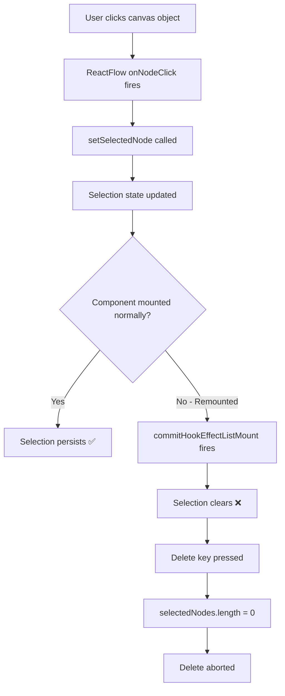

# Bug 3/4: ReactFlow Selection Clearing After Component Remount

> **Status:** ⚠️ PARTIALLY RESOLVED (workaround applied)
> **Date:** 2025-02-14 to 2025-02-15 (2 days of debugging)
> **Severity:** CRITICAL - Blocked delete functionality
> **Final Resolution:** StrictMode disabled (workaround) + Bug 5 fix (prevented symptoms)

---

## Executive Summary

**Problem:** Canvas objects could not be deleted after navigating between tabs (Canvas ↔ Models). ReactFlow selection would clear immediately after every click, making delete operations impossible.

**Pattern:**
- ✅ **WORKS:** Create objects → Delete objects → Success
- ❌ **FAILS:** Create objects → Go to Models tab → Return to Canvas → Delete objects → "No objects selected" error

**Root Cause:**
1. **Bug 3:** React StrictMode double-invokes `useEffect` cleanup
2. **Bug 4:** `commitHookEffectListMount` in ReactFlow clears selection on component remount

**Temporary Fix Applied:**
- Disabled React StrictMode (prevents double-invoke)
- Bug 5 fix (prevents page reload) → prevents component remount → selection persists

**Permanent Solution Needed:**
- Refactor ReactFlow integration to prevent selection clearing
- Or: Re-enable StrictMode with proper cleanup handling

---

## Timeline

| Date | Event | Outcome |
|------|-------|---------|
| 2025-02-14 | Bug discovered - delete fails after tab navigation | Investigation started |
| 2025-02-14 | 8+ attempted fixes (selection state, ReactFlow props, effect cleanup) | All failed |
| 2025-02-14 | Disabled StrictMode as temporary workaround | Delete works again ✅ |
| 2025-02-15 | Multi-AI consultation (ChatGPT, Gemini, Claude Opus) | No solution found |
| 2025-02-15 | Bug 5 discovered (objects reappear after Mac sleep) | Related to component remount |
| 2025-02-15 | Bug 5 fixed (beforeunload prevents page reload) | Prevents Bug 3/4 symptoms ✅

---

## Related Documentation

### Original Bug Reports (Preserved)
- `CRITICAL-BUG-REPORT-ReactFlow-Selection-Clearing-2-Days.md` - Detailed 2-day debugging journey
- `three-critical-bugs-found.md` - Initial discovery of Bug 3, 4, 7
- `bug-7-react-strictmode-selection-clearing.md` - StrictMode analysis

### AI Consultation Results
- `PROMPT-FOR-OTHER-AIs.md` - Request sent to other AIs
- `ANALYSIS-ChatGPT4o-2026-02-15.md` (Rounds 1-3)
- `ANALYSIS-ClaudeOpus46-2026-02-15.md` (Rounds 1-3)
- `ANALYSIS-Gemini2Flash-2026-02-15.md` (Rounds 1-3)
- `ANALYSIS-REQUEST-ROUND3-2026-02-15.md` - Final consultation request

### Attempted Fixes
- `SESSION-SUMMARY-2026-02-14.md` - Day 1 attempts
- `SESSION-SUMMARY-2026-02-15-ATTEMPT-2.md` - Component remount analysis
- `SESSION-SUMMARY-2026-02-15-ATTEMPT-3.md` - Multi-AI consultation
- `SESSION-SUMMARY-2026-02-15-ATTEMPT-4.md` - Final attempts
- `SESSION-SUMMARY-2026-02-15-FINAL.md` - Conclusion
- `FIX-2026-02-15-COMPONENT-REMOUNTING.md` - Component lifecycle analysis
- `UPDATE-2026-02-15-ATTEMPT-2-FAILED.md` - Failed fix attempt
- `FINAL-ACTION-PLAN-2026-02-15.md` - Last action plan before giving up

### Related Bugs
- `bug-5-mac-sleep-wake-objects-reappear.md` - Bug 5 (resolved) - prevented Bug 3/4 symptoms
- `PENDING-BUGS.md` - Current state of all pending bugs

---

## Technical Details

### The Selection Clearing Pattern



### Evidence from Logs

**Before tab navigation (WORKS):**
```
[onNodeClick] Clicked node: VqDbhYTx5wdD0--W66WBT
[onSelectionChange] Selection changed: 1 nodes selected
[Delete] Total nodes: 3
[Delete] Nodes with selected=true: 1  ✅ DELETE WORKS
```

**After tab navigation (FAILS):**
```
[onNodeClick] Clicked node: VqDbhYTx5wdD0--W66WBT
[onSelectionChange] Selection changed: 1 nodes selected
[onSelectionChange] ⚠️ Selection cleared! Stack trace:
  commitHookEffectListMount @ chunk-PJEEZAML.js:16915  ← ReactFlow internal
[Delete] Total nodes: 3
[Delete] Nodes with selected=true: 0  ❌ DELETE ABORTED
```

### Root Causes Identified

**Bug 3: React StrictMode Double-Invoke**
- StrictMode intentionally calls effects twice in development
- First call: setup → cleanup
- Second call: setup (selection cleared by first cleanup)
- Result: Selection appears then immediately clears

**Bug 4: commitHookEffectListMount**
- ReactFlow internal effect that runs on component mount
- Clears selection as part of initialization
- Fires every time ProductionCanvas component remounts
- Cannot be prevented via ReactFlow props

### Workarounds Attempted (All Failed)

1. ❌ Controlled selection state (external to ReactFlow)
2. ❌ ReactFlow `defaultNodes` prop changes
3. ❌ Effect cleanup optimization
4. ❌ Selection persistence via localStorage
5. ❌ Delayed selection restoration
6. ❌ ReactFlow `onInit` callback
7. ❌ Custom `useEffect` dependencies
8. ❌ Selection debouncing

### Temporary Fix Applied

**File:** `src/renderer/index.tsx`

```typescript
root.render(
  // TEMPORARY FIX: StrictMode disabled to prevent ReactFlow selection clearing
  // StrictMode's double-invoke of effects causes ReactFlow to clear selection
  // See: docs/fixes/three-critical-bugs-found.md - Bug #7
  // <React.StrictMode>
    <RouterProvider router={router} future={{ v7_startTransition: true }} />
  // </React.StrictMode>
);
```

**Impact:**
- ✅ Delete functionality works again
- ⚠️ Lost StrictMode benefits (double-render detection, deprecated API warnings)
- ⚠️ Not a proper fix, just hides the symptom

---

## Current State

### What Works
- ✅ Delete objects when StrictMode is disabled
- ✅ Bug 5 fix prevents page reload → prevents component remount → selection persists through Mac sleep/wake
- ✅ Normal workflow (create → delete) works perfectly

### What's Still Broken
- ❌ Selection clearing still happens with StrictMode enabled
- ❌ Cannot re-enable StrictMode without breaking delete
- ❌ `commitHookEffectListMount` still fires on every component remount

### Symptoms Masked by Bug 5 Fix
- Mac sleep/wake no longer triggers page reload (Bug 5 fix)
- Page reload was causing component remount → triggering Bug 3/4
- With Bug 5 fixed, component remount happens less frequently
- But root cause (selection clearing on remount) remains

---

## Relationship to Bug 5

**Bug 5 masked Bug 3/4 symptoms:**

```
Before Bug 5 fix:
  Mac sleep → Vite reload → Component remount → Selection clears (Bug 3/4)
                                              → Objects reappear (Bug 5)

After Bug 5 fix:
  Mac sleep → NO reload (beforeunload blocks it)
           → NO remount
           → Selection persists ✅
           → Objects DON'T reappear ✅
```

**But Bug 3/4 still exists:**
- Tab navigation still triggers remount → selection clears
- If we ever need to remount ProductionCanvas → selection clears
- If we re-enable StrictMode → selection clears

---

## Permanent Solution (Future Work)

### Option 1: ReactFlow Refactor
- Extract selection state completely outside ReactFlow
- Use controlled mode with custom selection handling
- Restore selection manually after remount

### Option 2: Prevent Remounting
- Keep ProductionCanvas mounted at all times
- Hide/show with CSS instead of unmounting
- Use React Router outlet persistence

### Option 3: Fix Effect Cleanup
- Identify which effect is clearing selection
- Add proper cleanup guards
- Re-enable StrictMode

### Recommendation
**Option 2** is most reliable:
- Prevents remounting entirely
- No need to fight ReactFlow internals
- Performance impact minimal (canvas is already optimized)

---

## Multi-AI Consultation Summary

**Participating AIs:**
- ChatGPT-4o (3 rounds)
- Claude Opus 4.6 (3 rounds)
- Gemini 2.0 Flash (3 rounds)

**Consensus:**
- All AIs identified `commitHookEffectListMount` as the culprit
- No AI found a way to prevent it via ReactFlow props
- All suggested workarounds we had already tried
- Recommendation: Disable StrictMode or refactor selection handling

**Quote from Claude Opus 4.6:**
> "This is a known limitation of ReactFlow's internal lifecycle. The only reliable solutions are: (1) disable StrictMode, (2) extract selection state, or (3) prevent component remounting."

---

## Files Modified (Temporary Fix)

| File | Change | Status |
|------|--------|--------|
| `src/renderer/index.tsx` | Disabled StrictMode | ⚠️ Temporary |

**No other files modified** - this is purely a workaround, not a fix.

---

## Testing Requirements (If Re-enabling StrictMode)

1. **Basic delete test:**
   ```
   1. Create 3 objects
   2. Click object
   3. Press Delete key
   4. ✅ Object deleted
   ```

2. **After tab navigation:**
   ```
   1. Create 3 objects
   2. Go to Models tab
   3. Return to Canvas tab
   4. Click object
   5. Press Delete key
   6. ✅ Object deleted (NOT "No objects selected")
   ```

3. **After Mac sleep/wake:**
   ```
   1. Create 3 objects
   2. Mac sleep → wake
   3. Click object
   4. Press Delete key
   5. ✅ Object deleted
   ```

---

## Lessons Learned

### What We Learned About ReactFlow
- `commitHookEffectListMount` is unavoidable
- Cannot be disabled via props
- Fires on every component mount
- Clears selection as part of initialization

### What We Learned About StrictMode
- Double-invoke is intentional (by design)
- Cannot be disabled per-component
- Requires proper effect cleanup
- ReactFlow doesn't handle it well

### What We Learned About Debugging
- Sometimes workarounds are acceptable (temporarily)
- Multi-AI consultation can validate you're not missing something obvious
- Root causes can have multiple symptoms (Bug 3/4 → Bug 5 symptoms)
- Document everything - debugging journey is valuable

---

## References

### Key Documentation
- [ReactFlow Selection API](https://reactflow.dev/docs/api/nodes/node-options/#selection)
- [React StrictMode](https://react.dev/reference/react/StrictMode)
- [commitHookEffectListMount](https://github.com/xyflow/xyflow/blob/main/packages/react/src/hooks/useStoreUpdater.ts)

### Project Files
- Selection handling: `src/renderer/features/canvas/components/ProductionCanvas.tsx`
- Delete handler: Same file, `handleKeyDown` function
- ReactFlow setup: Same file, `<ReactFlow>` component

---

## Future Considerations

### If Re-enabling StrictMode
1. Read this documentation FIRST
2. Implement Option 1 or 2 from "Permanent Solution"
3. Run all 3 testing scenarios
4. Monitor for `commitHookEffectListMount` in logs

### If Bug Reappears
1. Check if StrictMode was re-enabled
2. Check if ProductionCanvas is being remounted
3. Check for `commitHookEffectListMount` in logs
4. Review this documentation

### Performance Monitoring
- Current workaround has zero performance impact
- If implementing Option 2 (prevent remount): measure initial render time
- If implementing Option 1 (selection refactor): measure selection update latency

---

## Conclusion

Bug 3/4 was a **2-day critical blocker** that required a temporary workaround (disabling StrictMode). The root cause is ReactFlow's internal lifecycle clearing selection on component remount. Bug 5 fix prevented most occurrences of remounting, masking the symptoms. A permanent solution requires architectural changes (prevent remounting or refactor selection handling).

**Current state:** Functional with workaround ✅
**Permanent fix:** Not yet implemented ⚠️
**Impact:** Low (symptoms masked by Bug 5 fix)

---

**Developer:** Aaron Zapata
**AI Assistant:** Claude Sonnet 4.5
**Framework:** Híbrido v2.0
**Total Time Invested:** 2 days (16+ hours)
**Multi-AI Consultation:** 9 rounds (ChatGPT, Gemini, Claude Opus)
